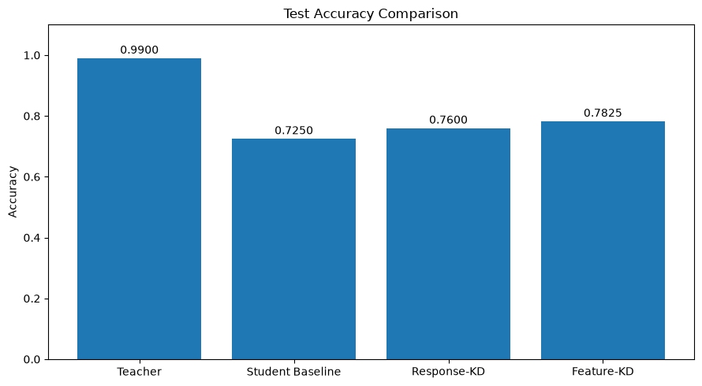
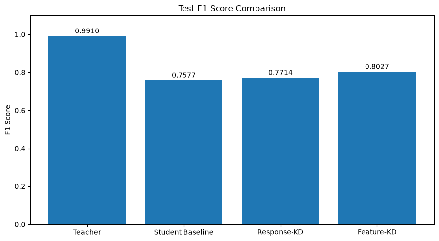

# Knowledge Distillation for Sentiment Classification

An Edge AI assignment exploring how a compact **BERT-Tiny student** can learn from a larger **DistilBERT teacher** on binary movie-review sentiment classification: negative (`0`) or positive (`1`).

The notebook compares supervised student training with **response-based** and **feature-based knowledge distillation**. Although the repository name also mentions quantization and pruning, the current assignment implements knowledge distillation.

## Repository contents

```text
Knowledge_Distillation_Assignment.ipynb  # Complete assignment with saved outputs
 data/
   train.csv                            # Original SST-2 training split
   validation.csv                       # Original SST-2 validation split
   test.csv                             # Official test split; labels are -1
   processed/
     train.csv                          # 2,000 labeled training examples
     validation.csv                     # 400 labeled validation examples
     test.csv                           # 400 labeled evaluation examples
 assets/
   test-accuracy.png                    # Final notebook accuracy plot
   test-f1.png                          # Final notebook F1 plot
```

Open [the assignment notebook](Knowledge_Distillation_Assignment.ipynb) for the explanations, dataset exploration, training code, and saved results. Model weights are downloaded or generated when the notebook runs and are not included in this repository.

## Dataset and experiment

The notebook loads **Stanford Sentiment Treebank (SST-2)** through Hugging Face Datasets. The original CSVs contain 67,349 training rows, 872 validation rows, and 1,821 official test rows.

For a smaller experiment, it selects 2,800 examples from the original training split and creates non-overlapping, stratified subsets of **2,000 / 400 / 400** examples with `random_state=42`. These are exported to `data/processed/`. The final metrics use the **400-example processed test subset**, not the official test CSV, whose labels are unavailable (`-1`). The official validation split is left untouched.

### Models and training methods

| Model | Role | Parameters |
|---|---|---:|
| `distilbert-base-uncased-finetuned-sst-2-english` | Frozen teacher, already fine-tuned for sentiment | 66,955,010 |
| `prajjwal1/bert-tiny` | Trainable student with a binary classification head | 4,386,178 |

The student has approximately **15.3 times fewer parameters** than the teacher. This is a parameter-count comparison; the notebook does not benchmark inference speed or memory consumption.

1. **Supervised baseline:** train BERT-Tiny for five epochs using cross-entropy against the ground-truth labels.
2. **Response-based distillation:** start from the trained baseline and train for five additional epochs. Combine supervised cross-entropy with KL divergence between the teacher's and student's softened output distributions. The temperature is `2.0`, the two losses have equal weights (`alpha=0.5`), and the KL term is scaled by the temperature squared.
3. **Feature-based distillation:** independently start from the same trained baseline and train for five additional epochs. Match the first-token (`[CLS]`) representations of student layers 1 and 2 to teacher layers 3 and 6. Two trainable linear projections map the student's 128-dimensional features to the teacher's 768 dimensions. The objective equally weights supervised cross-entropy and the average of the two feature MSE losses. The projections are training aids; student classification uses the student model alone.

All student training uses **AdamW**, a learning rate of **2e-5**, batch size **32**, and maximum token sequence length **128**. The notebook automatically selects CUDA if available; the saved run used CPU.

## Recorded evaluation results

These values come from the notebook's existing saved outputs, not a new training run. F1 is the binary F1 score for the positive class (`1`).

| Model | Test accuracy | Test F1 | Accuracy gain over baseline |
|---|---:|---:|---:|
| Teacher | 99.00% | 0.9910 | — |
| Student baseline | 72.50% | 0.7577 | — |
| Response-KD student | 76.00% | 0.7714 | +3.50 percentage points |
| Feature-KD student | **78.25%** | **0.8027** | **+5.75 percentage points** |

Feature-based distillation achieved the strongest student test performance in this run. Both distillation methods improved on the saved supervised baseline while retaining the same student architecture.

### Test accuracy



### Test F1 score



The two figures above are extracted directly from the final notebook outputs.

The notebook also reports validation accuracy / F1 of **0.7625 / 0.7865** for response-KD and **0.7475 / 0.7809** for feature-KD. Thus, the validation and test rankings differ in this run.

### How to interpret the comparison

- **Training budgets differ:** each distilled student receives five additional epochs after the five-epoch supervised baseline. A ten-epoch supervised control would help separate the effect of distillation from extra training.
- **Teacher exposure matters:** the teacher is already fine-tuned on SST-2, and this experiment draws its evaluation subset from SST-2's original training split. Treat the teacher score as a reference within this assignment, not evidence of performance on data unseen during teacher fine-tuning.
- **This is one small experiment:** the test subset contains 400 examples, with no repeated-seed results or uncertainty estimates. The split seed is fixed, but the notebook does not seed all training randomness, so rerun metrics can differ.

## Run the notebook

Use a Python environment with Jupyter and internet access for the initial dataset and model downloads.

```bash
git clone https://github.com/TurgudValiyev2002/model-compression-quantization-pruning.git
cd model-compression-quantization-pruning
python -m pip install jupyterlab
python -m jupyter lab Knowledge_Distillation_Assignment.ipynb
```

Select the intended Python kernel and run the cells from top to bottom with the repository root as the working directory. The dependency cell installs missing packages: NumPy, pandas, Matplotlib, scikit-learn, PyTorch, WordCloud, Datasets, Transformers, and huggingface_hub.

For missing installations, the notebook requests `datasets==4.8.5`, `transformers==4.57.0`, and `huggingface_hub==0.35.3`. Already-installed packages are left unchanged, so the dependency check does not enforce a fully pinned environment.

Running all cells loads SST-2 from Hugging Face, recreates and saves the processed CSVs, downloads the teacher and student, trains the three student variants, and displays the evaluation plots. The included CSVs are reference copies; the current loading cell does not read them as an offline data source.

Generated checkpoints are saved under:

```text
models/teacher/
models/student/
models/student_baseline/
models/student_response_kd/
models/student_feature_kd/
```

The feature-KD folder also contains the two learned projection state dictionaries. To inspect the recorded results without training, simply view the saved notebook outputs or the figures above.
